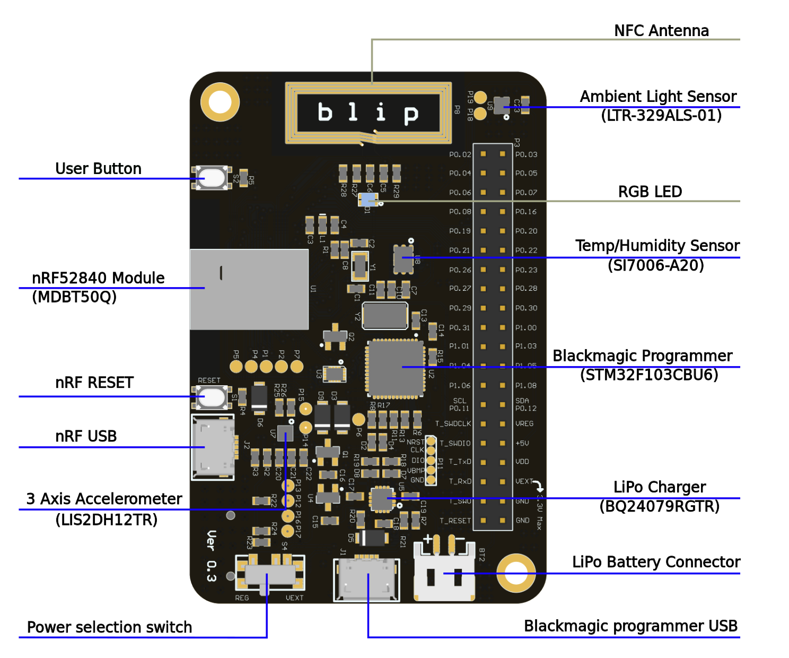

## Overview and Features

Blip is a development board for Bluetooth Low Energy (BLE) and 802.15.4 based wireless applications, based on the Nordic Semiconductor nRF52840 SoC. It has a Black Magic Probe compatible programmer and debugger built in, along with temperature/humidity sensor, ambient light intensity sensor, and a 3-axis accelerometer. It can be used to prototype very low power devices. It also has provision for an SD card slot, which makes it a complete and versatile development board.

## Features 

* Raytac MDBT50Q-1M module based on Nordic Semiconductor's nRF52840
* LIS2DDH12 High-performance 3-axis "femto" accelerometer 
* Optical Sensor LTR-329ALS-01
* Si7006-A20 I2C humidity and temperature sensor
* On board STM32F103CBT6 as Black magic probe debugger
* NFC Antenna
* MicroSD slot
* Power Supply: USB, JST connector for Li-ion/Li-po
* BQ24079 battery charging and power management IC

## Operating conditions

**Maximum Input Voltage**

* USB powered : 5V
* Vext = 1.8V to 3.3V
* Vbat = Lithium ion/polymer 3.7/4.2V battery

**Power Ratings**

* Max battery charging current : 150mA
* When powering with Vext, the debugger, charging IC, and LDO are bypassed for low current consumption

## Datasheet and schematic

You can find the schematic and datasheet in the links below:

* [Schematic](https://gitlab.com/electronutlabs/products/blip/blip-hardware/raw/master/pcb/blip/ver0.3/blip.pdf?inline=false)

## Blip Dimensions

## Repository

You can find sample firmware, datasheet, images etc. on its [repository](https://gitlab.com/electronutlabs-public/ElectronutLabs-blip).

## Purchasing Blip

Currently you can pre-order Blip by visiting this page - [Blip pre-order](https://electronut.in/products/blip/). Please email us at **info@electronut.in** if you have any questions.

## About Electronut Labs

**Electronut Labs** is an Embedded Systems company based in Bangalore, India. More information at our [website](https://electronut.in).
